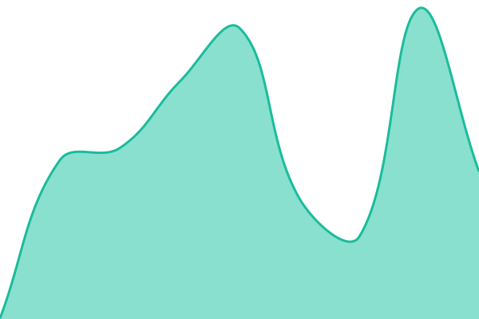

# [📈 Live Status](https://status.matthewahale.com): <!--live status--> **🟧 Partial outage**

This repository contains the open-source uptime monitor and status page for [Matthew Hale](matthewahale.com), powered by [Upptime](https://github.com/upptime/upptime).

With [Upptime](https://upptime.js.org), you can get your own unlimited and free uptime monitor and status page, powered entirely by a GitHub repository. We use [Issues](https://github.com/mahale89/status/issues) as incident reports, [Actions](https://github.com/mahale89/status/actions) as uptime monitors, and [Pages](https://status.matthewahale.com) for the status page.

<!--start: status pages-->
<!-- This summary is generated by Upptime (https://github.com/upptime/upptime) -->
<!-- Do not edit this manually, your changes will be overwritten -->
<!-- prettier-ignore -->
| URL | Status | History | Response Time | Uptime |
| --- | ------ | ------- | ------------- | ------ |
|  [Jellyfin](https://jellyfin.matthewahale.com/health) | 🟩 Up | [jellyfin.yml](https://github.com/mahale89/status/commits/HEAD/history/jellyfin.yml) | 

 215ms
     
 | 

<a href="https://status.matthewahale.com/history/jellyfin">93.27%</a>
    

|  [Requests](https://requests.matthewahale.com/api/v1/status) | 🟩 Up | [requests.yml](https://github.com/mahale89/status/commits/HEAD/history/requests.yml) | 

 340ms
     
 | 

<a href="https://status.matthewahale.com/history/requests">93.32%</a>
    

|  [Accounts](https://accounts.matthewahale.com) | 🟩 Up | [accounts.yml](https://github.com/mahale89/status/commits/HEAD/history/accounts.yml) | 

 298ms
     
 | 

<a href="https://status.matthewahale.com/history/accounts">93.37%</a>
    

|  [Audiobooks](https://audiobooks.matthewahale.com/healthcheck) | 🟩 Up | [audiobooks.yml](https://github.com/mahale89/status/commits/HEAD/history/audiobooks.yml) | 

 197ms
     
 | 

<a href="https://status.matthewahale.com/history/audiobooks">93.42%</a>
    

|  [Recipes](https://recipes.matthewahale.com) | 🟩 Up | [recipes.yml](https://github.com/mahale89/status/commits/HEAD/history/recipes.yml) | 

 231ms
     
 | 

<a href="https://status.matthewahale.com/history/recipes">93.47%</a>
    

|  [Website](https://matthewahale.com) | 🟥 Down | [website.yml](https://github.com/mahale89/status/commits/HEAD/history/website.yml) | 

 147ms
     
 | 

<a href="https://status.matthewahale.com/history/website">0.00%</a>
    

<!--end: status pages-->

[**Visit our status website →**](https://status.matthewahale.com)

## 📄 License

- Powered by: [Upptime](https://github.com/upptime/upptime)
- Code: [MIT](./LICENSE) © [Anand Chowdhary](https://anandchowdhary.com)
- Data in the `./history` directory: [Open Database License](https://opendatacommons.org/licenses/odbl/1-0/)
